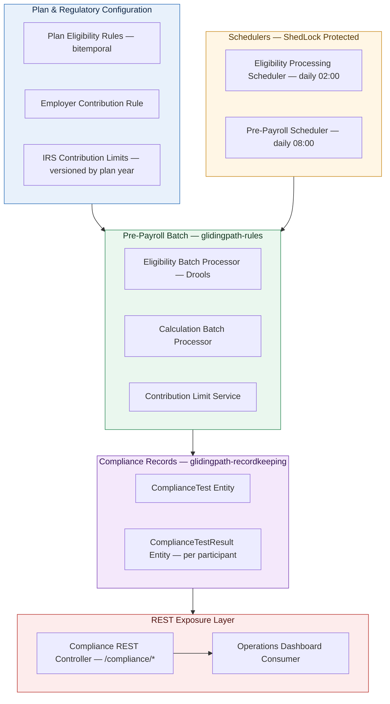
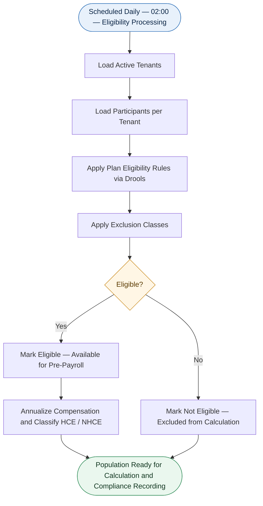
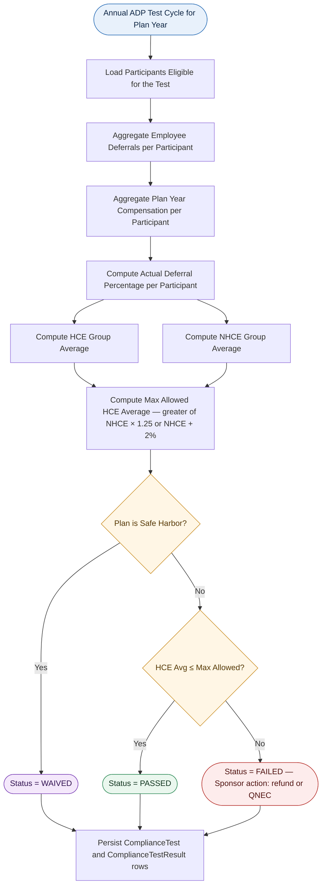
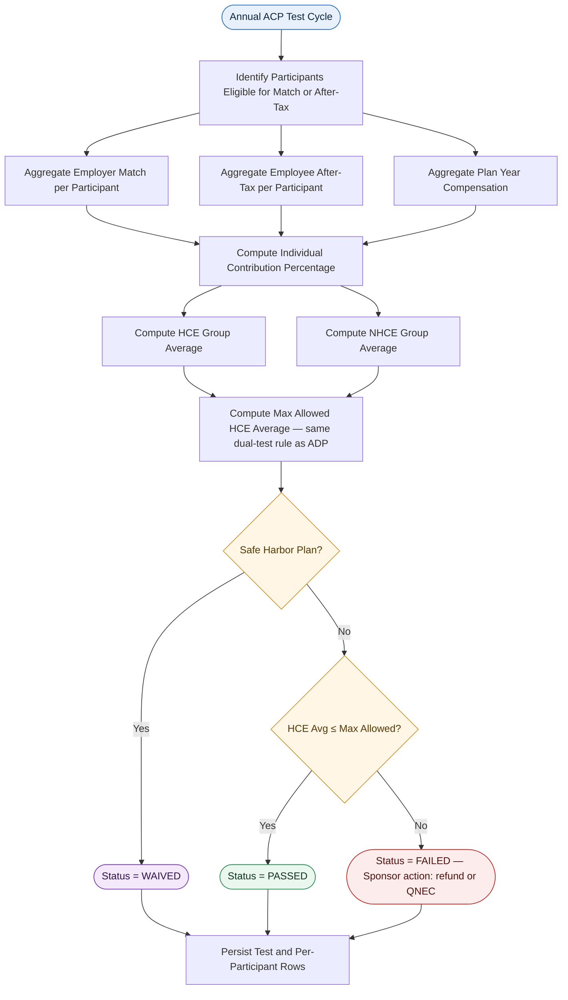
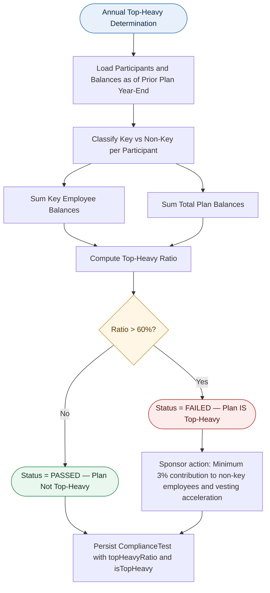
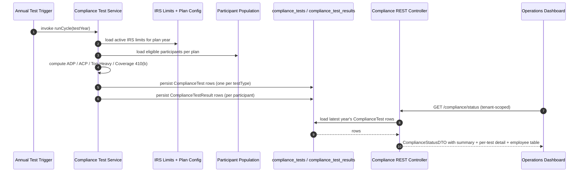
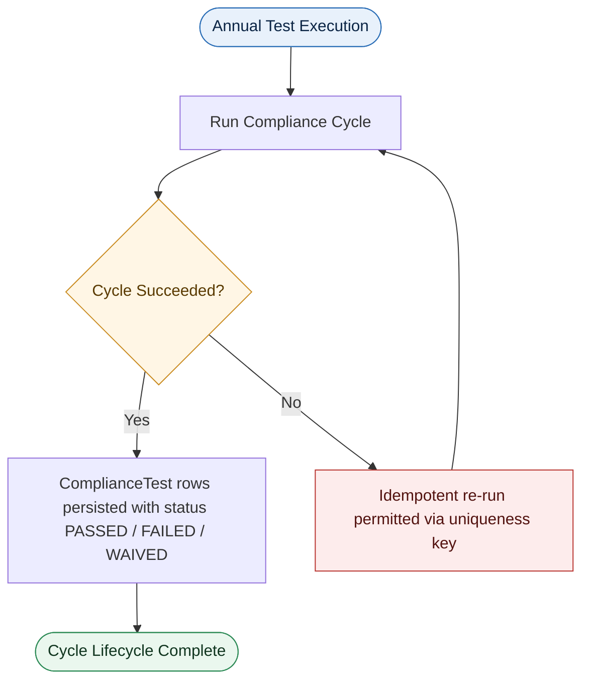

# 401(k) Compliance Testing System
## Technical Implementation Report

---

**Document Classification:** Internal — Implementation Reference
**Prepared For:** Executive Leadership, Product Management, Compliance, Engineering, Audit & Operations
**Document Type:** As-Built Implementation Report (grounded in source code)
**Platform:** GlidingPath Retirement Recordkeeping Backend
**System Domain:** Retirement Plan Compliance & Regulatory Validation
**Version:** 1.1

> **Reading note.** This report describes only what is present in the platform's source code today. Where a regulatory capability is partially built or pending data inputs, it is explicitly marked so leadership has an accurate picture of current state.

---

## Table of Contents

1. Executive Summary
2. System Overview
3. Participant Selection and Eligibility Logic
4. ADP Test (Actual Deferral Percentage)
5. ACP Test (Actual Contribution Percentage)
6. Top-Heavy Test
7. Coverage Testing – Section 410(b)
8. IRS Annual Contribution Limit Validation
9. Compliance Execution Lifecycle
10. Reporting and Audit Support
11. Intentionally Deferred Items
12. System Benefits
13. Conclusion

---

# 1. Executive Summary

## 1.1 Purpose of the Compliance Testing System

The GlidingPath Compliance Testing System is the regulatory validation layer of the platform. Its purpose is to determine, record, and report whether each 401(k) retirement plan administered through the platform satisfies the non-discrimination and contribution-limit rules established by the **Internal Revenue Service (IRS)** under the Internal Revenue Code, and to surface those outcomes to plan sponsors, recordkeepers, and auditors in a form they can act on.

The system is implemented across several modules of the backend:

| Module | Compliance Responsibility |
|---|---|
| `glidingpath-recordkeeping` | Authoritative storage of compliance test results, per-plan and per-participant; REST APIs that expose results to the operations dashboard. |
| `glidingpath-rules` | Real-time enforcement of IRS contribution limits (402(g), 414(v), 415(c), 401(a)(17)) during pre-payroll calculation; eligibility evaluation via Drools. |
| `glidingpath-scheduler` | Distributed-locked schedulers that drive the daily eligibility and pre-payroll pipelines. |
| `glidingpath-plan` | Plan-level configuration: eligibility rules (bitemporally versioned) and the employer contribution rule. |
| `glidingpath-participant` | Participant master data used for compensation, age, and classification inputs. |
| `glidingpath-contribution` | Payroll periods, payroll entries, and pre-payroll calculation records. |

## 1.2 Why Compliance Testing Matters in 401(k) Plans

Compliance testing is not a value-add — it is a statutory obligation. A plan that fails its annual non-discrimination tests, or that permits a participant to exceed an IRS contribution limit, may lose qualified status, trigger refund obligations, and expose the sponsor to penalties. The compliance subsystem is the platform's primary mechanism for preventing those outcomes.

## 1.3 High-Level Overview of the Implemented Solution

The implementation organizes regulatory coverage into two distinct workstreams:

1. **Real-Time Contribution Limit Enforcement (per payroll cycle)** — IRS dollar limits are evaluated and enforced inside the pre-payroll calculation pipeline before any contribution is settled.
2. **Annual Non-Discrimination Recording (per plan year)** — A persistent data model captures the outcome of the ADP, ACP, Top-Heavy, and Coverage 410(b) tests at a plan-year granularity, with participant-level detail, exposed to the operations dashboard via tenant-scoped REST endpoints.

A clearly-defined contract — the `ComplianceTest` and `ComplianceTestResult` entities — separates the *recording* of test outcomes from the *computation* of those outcomes, allowing each annual test's computation engine to be evolved independently.

## 1.4 Benefits of Automation and Compliance Validation

| Benefit | How It Is Realized in the Platform |
|---|---|
| **Real-time limit enforcement** | The pre-payroll calculator calls the limit service *before* contributions post, so excesses are prevented rather than reversed. |
| **Year-aware regulatory configuration** | IRS limit values live in a versioned, approval-tracked database table and are read per plan year — annual IRS updates do not require code changes. |
| **Tenant-scoped APIs** | Compliance status, per-test detail, and HCE/NHCE employee breakdowns are exposed through a tenant-isolated REST surface consumed by the operations dashboard. |
| **Audit defensibility** | Every test outcome carries plan, year, type, status, headline metrics, and a snapshot of the participants who contributed to the result. |
| **Multi-tenant isolation** | Every persistence query and batch read is filtered by `tenantId`, ensuring no cross-tenant data exposure. |

---

# 2. System Overview

## 2.1 Architectural Philosophy

The platform separates compliance into four concerns, each with a distinct module boundary:

1. **Configuration** — what the IRS rules and plan rules currently are.
2. **Enforcement** — applying limits and eligibility at the moment contributions are calculated.
3. **Recording** — persisting test outcomes with full participant-level detail.
4. **Exposure** — making those records available to dashboards and downstream consumers through tenant-scoped APIs.

This separation enables each compliance test to be implemented, validated, and tuned without disrupting the others.

## 2.2 Data Inputs

| Data Domain | Source Module | Role in Compliance |
|---|---|---|
| Participant master data (name, DOB, compensation, ownership) | `glidingpath-participant` | Demographics, age, HCE/Key-Employee inputs. |
| Plan eligibility rules (age, service, exclusions) | `glidingpath-plan` | Determines who is eligible. |
| Employer contribution rule (match formula) | `glidingpath-plan` | Determines employer contributions. |
| IRS contribution limits (yearly, versioned) | `glidingpath-rules` | Drives every dollar limit check. |
| Payroll periods & entries | `glidingpath-contribution` | Source of compensation and deferral records. |
| Pre-payroll calculations | `glidingpath-contribution` | Validated contribution amounts before settlement. |
| Compliance tests & per-participant results | `glidingpath-recordkeeping` | Persistent record of annual test outcomes. |

## 2.3 Processing Stages

Within the implemented system, the data flow is:

1. **Schedulers fire** (daily, distributed-lock protected) and trigger eligibility and pre-payroll batch jobs.
2. **Eligibility evaluation** runs participants through Drools-based rule evaluation against plan eligibility configuration.
3. **Pre-payroll calculation** computes proposed contributions for each eligible participant and immediately validates them against the IRS limit service.
4. **Compliance test records** are persisted to the `compliance_tests` and `compliance_test_results` tables when an annual test cycle is run.
5. **REST endpoints** under `/compliance/*` expose the latest results, per-year results, and per-employee data to the operations dashboard.

## 2.4 High-Level Architecture Diagram



---

# 3. Participant Selection and Eligibility Logic

## 3.1 Business Purpose

Before any compliance test can produce a defensible result, the system must determine which employees belong in the evaluated population. Eligibility logic answers two related questions: **"Is this employee eligible to participate in the plan?"** and **"Should this employee be included in this specific compliance test?"**

## 3.2 How Plan Eligibility Is Determined

Plan eligibility is configured per plan via the `PlanEligibility` entity in `glidingpath-plan`. This entity is **bitemporally versioned**: every change is tracked with effective dates, and an `is_current` flag identifies the live version. Historical eligibility decisions can therefore always be traced back to the rules that were in force on the date they were made.

The configurable parameters on `PlanEligibility` are:

| Parameter | Description |
|---|---|
| **Minimum entry age** | The age below which an employee cannot enter the plan. |
| **Time employed (months)** | Required tenure before plan entry. |
| **Exclusion types** | Classes of employees excluded by the plan document. |

## 3.3 How Eligibility Is Evaluated at Runtime

Eligibility evaluation runs as a Spring Batch job orchestrated by `EligibilityProcessingScheduler` (in `glidingpath-scheduler`). The scheduler fires daily at 02:00 (configurable via `scheduler.eligibility.cron`) and is wrapped in **ShedLock distributed locking** (`lockAtMostFor: 30m`, `lockAtLeastFor: 1m`) so that, in a multi-instance deployment, only one node performs the evaluation.

Inside the batch:

1. **Eligibility Batch Reader** loads participants for each active tenant.
2. **Eligibility Batch Processor** delegates to the Drools rule evaluator, which applies the plan's eligibility rules to each participant's age, hire date, and exclusion class.
3. **Eligibility Batch Writer** persists the resulting eligibility decisions for downstream use.

## 3.4 HCE vs NHCE Identification

The dashboard read-side (`ComplianceTestServiceImpl`, in `glidingpath-recordkeeping`) classifies each participant for the on-screen HCE/NHCE breakdown using a **simplified compensation-based rule**: participants whose annualized compensation exceeds an HCE threshold are flagged as HCE; all others are NHCE.

The `ComplianceTestResult` entity stores authoritative HCE classification (`isHce`) and Key-Employee classification (`isKeyEmployee`, `isFivePercentOwner`) on a per-participant basis, designed for the full IRS rule including ownership and prior-year compensation. Today, the dashboard's HCE flag is derived solely from compensation; ownership-based classification fields on the participant record are not yet populated upstream, which is noted explicitly in §6 and §12.

## 3.5 Compensation Handling

Participant income is captured in the `PlanParticipant` entity with a unit (yearly, monthly, biweekly, weekly, hourly). The dashboard service **annualizes** all units to a yearly figure before applying any percentage or threshold logic, so that a participant paid hourly and a participant paid annually are evaluated on the same basis.

## 3.6 Participant Selection Workflow



---

# 4. ADP Test (Actual Deferral Percentage)

## 4.1 What Is the ADP Test?

The **Actual Deferral Percentage (ADP) Test** is the IRS's primary fairness check for employee elective deferrals into a traditional 401(k) plan. Its purpose is to confirm that **highly compensated employees (HCEs) are not deferring at a disproportionately higher rate than non-highly compensated employees (NHCEs).** Safe Harbor plans are exempt and are marked **WAIVED** rather than evaluated.

### Why the IRS Requires It

The ADP test exists to prevent retirement plans from operating as tax-advantaged savings vehicles primarily for owners and executives. Without it, a plan could be structured so that only well-paid employees benefit meaningfully from the deferral feature.

### Fairness Rule Validated

The HCE group's average deferral percentage must not exceed the NHCE group's average by more than the IRS-prescribed **dual-test maximum**.

## 4.2 Formula Used (as implemented)

### Individual Deferral Percentage

For each participant included in the test, the system records:

> **Actual Deferral Percentage = Employee Deferrals ÷ Plan Year Compensation**

Both values are stored on the `ComplianceTestResult` row (`employeeDeferrals`, `planYearCompensation`, `actualDeferralPercentage`).

### Group Averages

> **HCE Average ADP** = average `actualDeferralPercentage` across participants where `isHce = true`
> **NHCE Average ADP** = average `actualDeferralPercentage` across participants where `isHce = false`

Both averages are persisted on the `ComplianceTest` row (`hceAveragePercentage`, `nhcAveragePercentage`).

### HCE vs NHCE Comparison Rule

The maximum allowed HCE average is stored on the test row as `maxAllowedHcePercentage`, calculated as the **greater** of:

| Threshold | Rule |
|---|---|
| **NHCE Average × 1.25** | First allowable ceiling. |
| **NHCE Average + 2%** | Alternative ceiling (capped at 2× NHCE average per IRS rules). |

The test row's `status` becomes **PASSED** when `hceAveragePercentage ≤ maxAllowedHcePercentage`, **FAILED** otherwise, or **WAIVED** for Safe Harbor plans.

## 4.3 ADP Test Flow Diagram



## 4.4 Corrective Action Vocabulary

The `ComplianceTest` entity stores a `correctiveAction` value drawn from this vocabulary:

| Code | Meaning |
|---|---|
| `REFUND_EXCESS` | Refund excess HCE deferrals (typical first-line remediation). |
| `QNEC` | Qualified Non-Elective Contribution — boost NHCE side instead of refunding HCEs. |
| `QMAC` | Qualified Matching Contribution — used on the ACP side. |
| `RECHARACTERIZE` | Recharacterize HCE pre-tax deferrals as after-tax. |

A `correctiveActionDate` field on the same entity records when the action was completed, and an `excessContributions` field captures the aggregate dollar amount of refunds required.

## 4.5 Implementation Status

The data model, persistence layer, and dashboard exposure for the ADP test are fully implemented. The **annual ADP test computation engine** — the code that loads the participant population, computes the percentages, and writes a new `ComplianceTest` row — is the next step on the roadmap; the contract (entity shape, status codes, corrective-action codes) is already locked in.

---

# 5. ACP Test (Actual Contribution Percentage)

## 5.1 Business Purpose

The **Actual Contribution Percentage (ACP) Test** is the companion to the ADP test, but it focuses on **employer matching contributions and employee after-tax contributions** rather than elective deferrals. It ensures that an aggressive match formula or an after-tax feature does not produce a disproportionate benefit to HCEs.

## 5.2 Contributions Evaluated

The `ComplianceTestResult` entity records both `employerMatch` and `employeeAfterTax` for each participant. ACP is computed as the sum of those two figures, expressed as a percentage of plan-year compensation:

| Contribution Type | Included in ACP |
|---|---|
| Employer Matching Contributions | Yes |
| Employee After-Tax Contributions | Yes |
| Pre-tax / Roth elective deferrals | No (handled by ADP) |
| Employer Non-Elective / Profit Sharing | No (handled via Coverage 410(b)) |

## 5.3 Formula Used

### Individual Contribution Percentage

> **Actual Contribution Percentage = (Employer Match + Employee After-Tax) ÷ Plan Year Compensation**

### Group Averages

Stored on the `ComplianceTest` row in the same fields used for ADP (`hceAveragePercentage`, `nhcAveragePercentage`), differentiated by `testType = "ACP"`.

### HCE vs NHCE Comparison Rule

Same dual-test ceiling as the ADP test:

| Threshold | Rule |
|---|---|
| **NHCE Average × 1.25** | First allowable ceiling. |
| **NHCE Average + 2%** | Alternative ceiling. |

## 5.4 Execution Workflow

1. Identify participants who were eligible for match or after-tax contributions during the plan year.
2. Aggregate employer match and after-tax dollars per participant.
3. Aggregate plan-year compensation per participant.
4. Compute the individual contribution percentage for each.
5. Compute HCE and NHCE averages.
6. Compute the allowable maximum.
7. Record pass/fail (or waived, for Safe Harbor) on the `ComplianceTest` row.

## 5.5 ACP Test Flow Diagram



## 5.6 Employer Match Configuration Awareness

The system's employer-match computation logic (used by the dashboard's per-employee ACP figure) understands six match-rule shapes configured on the `EmployerContributionRule` entity in `glidingpath-plan`:

| Match Rule Type | Description |
|---|---|
| `BASIC_MATCH` | Tiered (e.g., 100% on first 3%, 50% on next 2%). |
| `ENHANCED_MATCH` | Two-tier enhanced configuration. |
| `SAFE_HARBOR_NON_ELECTIVE` | Flat percentage for all employees. |
| `SAFE_HARBOR_ENHANCED_MATCH` | Standard 100%/3% + 50%/2% safe harbor. |
| `FLEXIBLE_MATCH` | Simple percentage of employee contribution. |
| `NO_CONTRIBUTION` | No employer match. |

This lets the ACP evaluation serve plans with quite different match formulas without code change.

---

# 6. Top-Heavy Test

## 6.1 Business Purpose

A plan is considered **Top-Heavy** when more than **60%** of total account balances are concentrated in the accounts of **Key Employees** — generally officers and owners. A top-heavy result is not, in itself, a failure; rather, it triggers a *minimum contribution obligation* for non-key employees and accelerated vesting requirements, ensuring that owner-heavy plans still deliver real benefits to rank-and-file employees.

## 6.2 How Key Employees Are Identified

The `ComplianceTestResult` entity stores three flags used by the top-heavy test:

| Flag | Source Field |
|---|---|
| **Key employee** | `isKeyEmployee` |
| **5%-owner** | `isFivePercentOwner` |
| **HCE** | `isHce` |

In the IRS definition, an employee is a Key Employee if they are (a) an officer earning above the IRS officer threshold, (b) a 5%-owner, or (c) a 1%-owner earning above the IRS 1%-owner threshold. The data model is built to capture all three; the dashboard's read-side currently sets `isKeyEmployee` to `false` because the upstream ownership data has not yet been wired to the participant record — see §6.6.

## 6.3 Formula Used

> **Top-Heavy Ratio = Total Account Balances of Key Employees ÷ Total Account Balances of All Participants**

A plan is top-heavy when:

> **Top-Heavy Ratio > 60%**

The `ComplianceTest` entity captures both the computed `topHeavyRatio` and a boolean `isTopHeavy` flag, plus a `keyEmployeeCount` field for the number of Key Employees identified.

## 6.4 Implementation Flow

1. Load all participants for the plan with balances as of the determination date (the prior plan year-end).
2. Classify each as Key or Non-Key, persisting `isKeyEmployee` on the result row.
3. Sum account balances for the Key group.
4. Sum account balances across all participants.
5. Divide to produce the ratio.
6. Set `isTopHeavy = ratio > 60%`.
7. Persist the `ComplianceTest` row with `testType = "TOP_HEAVY"`.

## 6.5 Top-Heavy Test Flow Diagram



## 6.6 Implementation Status and Known Data Gap

The top-heavy entity model and threshold logic are implemented. The recommended sponsor action for a top-heavy result is to provide a minimum contribution to non-key employees equal to the lesser of 3% of compensation or the highest contribution rate received by any key employee.

**Known data gap:** the ownership classification fields (`isFivePercentOwner`, the officer threshold check) require ownership data that is not yet captured on the `PlanParticipant` master record. As a result, the dashboard service currently emits `isKeyEmployee = false` for all participants. Full top-heavy evaluation will require completing the participant ownership capture work.

---

# 7. Coverage Testing – Section 410(b)

## 7.1 Business Purpose

The **Coverage Test under IRC Section 410(b)** confirms that a plan benefits a sufficiently broad cross-section of non-highly-compensated employees relative to highly compensated ones. The implementation models coverage at the **contribution-source level**, distinguishing four sub-tests:

| Sub-Test | Test Type Code |
|---|---|
| Deferral coverage | `COVERAGE_410B_DEFERRAL` |
| Match coverage | `COVERAGE_410B_MATCH` |
| Non-elective coverage | `COVERAGE_410B_NONELECTIVE` |
| Profit sharing coverage | `COVERAGE_410B_PROFIT_SHARING` |

This level of granularity is necessary because a plan can pass coverage on one source and fail on another (e.g., everyone is eligible for the match, but the profit-sharing allocation excludes a class of employees).

## 7.2 Identifying Benefiting Employees

Within each sub-test, a participant is treated as "benefiting" if they received a contribution of the relevant source type during the plan year. Non-zero contribution amounts on the `ComplianceTestResult` row serve as the proxy for benefiting status on each sub-test.

## 7.3 Formula Used

> **HCE Coverage Ratio = Benefiting HCEs ÷ Total Eligible HCEs**
> **NHCE Coverage Ratio = Benefiting NHCEs ÷ Total Eligible NHCEs**
> **Coverage Ratio (Ratio Percentage Test) = NHCE Coverage Ratio ÷ HCE Coverage Ratio**

The plan passes if:

> **Coverage Ratio ≥ 70%**

The `ComplianceTest` entity stores `coverageRatio` and `minCoverageRatioRequired` (typically `0.70`) on each coverage test row.

## 7.4 Failure Remediation

When the Coverage 410(b) test fails, the recommended sponsor actions are: **expand eligibility to include more non-HCEs, increase non-HCE participation, or qualify under the Average Benefits Test as the alternative.** Safe Harbor plans are recorded as **WAIVED** because deferral coverage is deemed satisfied under Safe Harbor rules.

## 7.5 Coverage Test Flow Diagram

```mermaid
flowchart TD
    A([Annual Coverage 410(b) Cycle — one pass per source: Deferral / Match / Nonelective / Profit Sharing])
    B[Identify Eligible Population]
    C[Classify HCE vs NHCE]
    D[Identify Benefiting HCEs for This Source]
    E[Identify Benefiting NHCEs for This Source]
    F[Compute HCE Coverage Ratio]
    G[Compute NHCE Coverage Ratio]
    H[Compute Coverage Ratio = NHCE / HCE]
    SH{Safe Harbor Deferral Source?}
    W([Status = WAIVED])
    I{Coverage Ratio ≥ 70%?}
    P([Status = PASSED])
    Fail([Status = FAILED — Sponsor action: expand eligibility or Average Benefits Test])
    Persist[Persist ComplianceTest row with testType = COVERAGE_410B_*]

    A --> B --> C
    C --> D --> F
    C --> E --> G
    F --> H
    G --> H
    H --> SH
    SH -- Yes --> W --> Persist
    SH -- No --> I
    I -- Yes --> P --> Persist
    I -- No --> Fail --> Persist

    style A fill:#E8F1FB,stroke:#2C6FB7,color:#0B2545
    style P fill:#EAF7EE,stroke:#2E8B57,color:#10351F
    style Fail fill:#FDECEC,stroke:#B8332E,color:#52120F
    style W fill:#F4E8FB,stroke:#7A3FB5,color:#321253
    style I fill:#FFF6E5,stroke:#C98A1E,color:#5A3A00
    style SH fill:#FFF6E5,stroke:#C98A1E,color:#5A3A00
```

---

# 8. IRS Annual Contribution Limit Validation

This is the most operationally active part of the compliance subsystem: contribution limits are enforced **in real time** during pre-payroll calculation, not as an end-of-year reconciliation. This means an excess never gets settled — it is prevented at the point of calculation.

## 8.1 Business Purpose

The IRS publishes statutory dollar limits each plan year that cap the amount any individual may contribute to, or receive in, a 401(k) plan. Violating these limits triggers refund obligations, taxable distributions, and potential plan disqualification.

## 8.2 Limits Implemented

Limit values are stored in the `irs_contribution_limits` table in `glidingpath-rules`, **versioned by plan year**, with an approval workflow (DRAFT → PENDING_APPROVAL → APPROVED → ACTIVE → LOCKED) that prevents accidental edits to a year that is already in production. The implemented limit types include:

| Limit Code | IRC Reference | Purpose |
|---|---|---|
| `LIMIT_402G` | §402(g) | Annual elective deferral limit. |
| `LIMIT_402G_STARTER` | §402(g) — Starter 401(k) | Reduced limit for Starter plans. |
| `LIMIT_414V_CATCH_UP` | §414(v) | Catch-up contribution for age 50+. |
| `LIMIT_414V_STARTER` | §414(v) — Starter | Reduced catch-up for Starter plans. |
| `LIMIT_415C` | §415(c) | Total annual additions cap. |
| `LIMIT_415C_STARTER` | §415(c) — Starter | Reduced annual additions for Starter. |
| `LIMIT_401A17` | §401(a)(17) | Maximum compensation considered for plan purposes. |
| `LIMIT_414Q_HCE` | §414(q) | HCE prior-year compensation threshold. |
| `LIMIT_416_KEY_OFFICER` | §416 | Key-employee officer compensation threshold. |
| `LIMIT_416_KEY_1PCT` | §416 | Key-employee 1%-owner compensation threshold. |

A dedicated migration service (`IrsLimits2026MigrationService`) creates the 2026 values idempotently, and a super-admin REST endpoint (`POST /api/v1/irs-limits/migrate/2026`) triggers it. This pattern is the standard for onboarding each new plan year's limits.

## 8.3 How Limits Are Enforced

The `ContributionLimitService` exposes a small set of operations:

| Operation | What It Does |
|---|---|
| `checkEmployeeDeferralLimit(...)` | Validates that an employee's deferral does not exceed 402(g), accounting for catch-up eligibility for participants aged 50+. |
| `checkTotalAnnualLimit(...)` | Validates 415(c) total annual additions. |
| `checkCatchUpEligibility(...)` | Confirms catch-up eligibility based on age. |

Each operation returns a structured result containing a **status** (`ALLOWED`, `EXCEEDED`, or `ERROR`), the maximum allowed amount, the proposed amount, the excess amount (if any), and a human-readable message. The service also exposes year-aware retrieval methods (`getLimit402g(planYear)`, `getCatchUpLimit(planYear)`, etc.) so the calculator always uses the correct year's limit.

For resilience, the service contains hardcoded fallback values for recent plan years so that a database outage cannot leave limit enforcement disabled.

## 8.4 Where Enforcement Happens

The `CalculationBatchProcessor` (in `glidingpath-rules`) is the operational core of pre-payroll calculation. For each eligible participant:

1. It computes the proposed contribution amounts.
2. It calls `ContributionLimitService` to validate each amount against the applicable IRS limit.
3. If an excess is detected, it is recorded and the calculation is bounded to the allowable amount.

This means **the platform refuses to settle an over-limit contribution in the first place** — limit enforcement is preventive, not corrective.

## 8.5 Validation Flow Diagram

```mermaid
flowchart TD
    A([Pre-Payroll Calculation per Eligible Participant])
    B[Compute Proposed Employee Deferral]
    C[Compute Proposed Employer Contributions]
    D[Compute YTD Aggregates for Plan Year]

    L1{Deferral ≤ 402(g) limit for plan year?}
    L2{Eligible for Catch-Up — Age ≥ 50?}
    L3{Deferral plus Catch-Up ≤ 402(g) + 414(v) ?}
    L4{Total Additions ≤ 415(c) limit?}
    L5{Compensation ≤ 401(a)(17) cap?}

    Excess[Mark Excess on Calculation Row — Bound to Allowable Amount]
    OK([Calculation Passes All Limit Checks])
    Persist[Persist PrePayrollCalculation Row]

    A --> B
    A --> C
    A --> D
    B --> L1
    L1 -- Yes --> L4
    L1 -- No --> L2
    L2 -- Yes --> L3
    L2 -- No --> Excess
    L3 -- Yes --> L4
    L3 -- No --> Excess
    C --> L4
    D --> L5
    L4 -- Yes --> L5
    L4 -- No --> Excess
    L5 -- Yes --> OK
    L5 -- No --> Excess
    Excess --> Persist
    OK --> Persist

    style A fill:#E8F1FB,stroke:#2C6FB7,color:#0B2545
    style OK fill:#EAF7EE,stroke:#2E8B57,color:#10351F
    style Excess fill:#FDECEC,stroke:#B8332E,color:#52120F
    style L1 fill:#FFF6E5,stroke:#C98A1E,color:#5A3A00
    style L2 fill:#FFF6E5,stroke:#C98A1E,color:#5A3A00
    style L3 fill:#FFF6E5,stroke:#C98A1E,color:#5A3A00
    style L4 fill:#FFF6E5,stroke:#C98A1E,color:#5A3A00
    style L5 fill:#FFF6E5,stroke:#C98A1E,color:#5A3A00
```

## 8.6 Limit Violations in the Compliance Record

When limit violations occur, the compliance subsystem records them as test rows alongside the non-discrimination tests, using the type codes `CONTRIBUTION_LIMIT_415`, `ELECTIVE_DEFERRAL_402G`, `CATCHUP_414V`, and `COMPENSATION_LIMIT_401A17`. Each row carries its own recommended sponsor action:

| Limit | Recommended Sponsor Action on Failure |
|---|---|
| 415(c) | Refund or reclassify the excess additions. |
| 402(g) | Refund excess deferrals before the IRS April 15 deadline. |
| 414(v) | Treat the excess as an ordinary 402(g) overage and refund. |
| 401(a)(17) | Informational; the cap is **automatically applied inside contribution calculations**. |

---

# 9. Compliance Execution Lifecycle

## 9.1 Two Operating Cadences

The compliance subsystem runs at two cadences:

1. **Daily — Real-Time Limit Enforcement.** The `EligibilityProcessingScheduler` (02:00) and `PrePayrollScheduler` (08:00) drive the daily batch pipeline. The pre-payroll scheduler is feature-gated behind `scheduler.pre-payroll.enabled` and uses ShedLock to prevent overlapping runs. Pre-payroll calculation invokes `ContributionLimitService` to validate every proposed contribution.
2. **Per Annual Cycle — Non-Discrimination Tests.** When an ADP, ACP, Top-Heavy, or Coverage test cycle is executed, the resulting `ComplianceTest` rows are persisted under a unique `(tenant_id, plan_id, test_year, test_type)` constraint, making them immediately visible through the REST exposure layer.

## 9.2 Scheduler Behaviour

| Scheduler | Default Trigger | Distributed Lock | Purpose |
|---|---|---|---|
| `EligibilityProcessingScheduler` | Daily 02:00 (`scheduler.eligibility.cron`) | ShedLock — `lockAtMostFor: 30m`, `lockAtLeastFor: 1m` | Evaluate participant eligibility for every active tenant. |
| `PrePayrollScheduler` | Daily 08:00 (`scheduler.pre-payroll.cron`) | ShedLock — `lockAtMostFor: 10m`, `lockAtLeastFor: 5m` | Find payroll periods at cutoff and trigger pre-payroll calculation. |

The pre-payroll scheduler dispatches calculation work through a `PrePayrollEventPublisher` interface — either an SQS-backed publisher (for asynchronous processing) or a no-op publisher that invokes the orchestrator service inline. This indirection lets the platform run in both queue-backed and single-instance modes without code changes.

## 9.3 Per-Cycle Persistence Guarantees

Each `ComplianceTest` row is keyed by `(tenant_id, plan_id, test_year, test_type)`. This unique constraint provides two important guarantees:

| Guarantee | Effect |
|---|---|
| **Idempotent re-runs** | Re-running a test cycle for the same plan year cannot accidentally produce duplicate result rows. |
| **Historical preservation** | Once a year is recorded, the database retains it indefinitely — historical results are always queryable. |

Per-participant detail is stored on `ComplianceTestResult` rows tied to the parent `ComplianceTest` via foreign key, with cascade delete on the relationship so a removed test cycle cleanly takes its participant rows with it.

## 9.4 Sequence Diagram — End-to-End Annual Cycle



## 9.5 Failure Handling



The REST controller is defensively coded: every endpoint catches downstream exceptions and returns an empty status object rather than a 500 error if upstream data is missing. This preserves dashboard availability during partial outages.

---

# 10. Reporting and Audit Support

## 10.1 Compliance Exposure Surface

Compliance data is exposed to the operations dashboard through the `ComplianceTestController` in `glidingpath-recordkeeping`, under the `/compliance` path. Every endpoint is tenant-scoped via the authenticated user's `tenantId`:

| Endpoint | Purpose |
|---|---|
| `GET /compliance/status` | Latest-year dashboard: needs-attention count, warning count, pass count, per-test summaries, employee table, last update timestamp. |
| `GET /compliance/status/{year}` | Same as above, scoped to a specific plan year. |
| `GET /compliance/tests` | All compliance tests for the tenant across years. |
| `GET /compliance/tests/year/{year}` | Compliance tests for a specific year. |
| `GET /compliance/tests/{testId}` | Detail for a single compliance test. |
| `GET /compliance/employees` | Per-employee HCE/NHCE breakdown with ADP%, ACP%, account balance, deferrals, and employer match. HCEs are sorted first, then by balance descending. |

## 10.2 Compliance Status Summary

The status endpoint returns a `ComplianceStatusDTO` containing:

| Field | Meaning |
|---|---|
| `needsAttention` | Count of tests with status `FAILED`. |
| `warning` | Count of tests with status `PENDING` or `IN_PROGRESS`. |
| `passes` | Count of tests with status `PASSED`, `WAIVED`, or `CORRECTED`. |
| `companyInfoComplete` | Whether company-level configuration is complete. |
| `employeeInfoComplete` | Whether at least one participant is loaded. |
| `tests` | List of per-test summaries (HCE avg, NHCE avg, max allowed, ratios). |
| `employeeData` | List of per-employee compliance rows. |
| `lastUpdated` | Latest `testDate` across the year's tests. |
| `testYear` | The plan year reflected in the response. |

## 10.3 Per-Test Summary Detail

Each entry in the `tests` array carries:

- Test type code (ADP, ACP, TOP_HEAVY, COVERAGE_410B, CONTRIBUTION_LIMIT_415, etc.)
- Human-readable test name
- Status (PASSED, FAILED, WAIVED, CORRECTED, PENDING, IN_PROGRESS)
- Test date
- HCE average percentage (for ADP/ACP)
- NHCE average percentage (for ADP/ACP)
- Maximum allowed HCE percentage (for ADP/ACP)
- Top-Heavy ratio (for Top-Heavy)
- Coverage ratio (for Coverage 410(b))
- Result description sentence

## 10.4 Per-Employee Compliance Detail

The `/compliance/employees` endpoint returns one row per participant, including:

| Field | Description |
|---|---|
| `name` | Participant full name (subject to platform-wide masking policy). |
| `category` | "HCE" or "Non-HCE". |
| `adp` / `adpValue` | ADP figure as formatted string and as numeric value. |
| `acp` / `acpValue` | ACP figure as formatted string and as numeric value. |
| `adjustedBalance` | Current account balance. |
| `employeeDeferrals` | Total employee deferral contributions. |
| `employeeMatch` | Total employer match contributions. |
| `planYearCompensation` | Annualized plan-year compensation. |
| `isHce`, `isKeyEmployee` | Classification flags. |

Rows are sorted with HCEs first (by category), then by adjusted balance descending — placing the highest-exposure records at the top of the dashboard.

## 10.5 Audit Trail Stored on Every Test Row

The `ComplianceTest` entity captures, in addition to the test result itself, an extensive audit footprint:

| Field | Audit Purpose |
|---|---|
| `tenantId`, `planId`, `testYear`, `testType` | Unique identity of the test cycle. |
| `status` | Current outcome state — `PENDING`, `IN_PROGRESS`, `PASSED`, `FAILED`, `CORRECTED`, `WAIVED`. |
| `testDate` | Date the test was executed. |
| `testedBy`, `reviewedBy` | User IDs of executor and reviewer. |
| `totalParticipantsTested`, `hceCount`, `nhcCount`, `keyEmployeeCount` | Population sizes for the test. |
| `excessContributions` | Aggregate dollar excess if test failed. |
| `correctiveAction`, `correctiveActionDate` | Tracking of remediation. |
| `testMethodology`, `notes` | Free-text fields for narrative context. |
| `reportFileId` | Optional link to an externally generated report artifact. |
| `createdAt`, `updatedAt` | Standard lifecycle timestamps inherited from `BaseEntity`. |

## 10.6 Participant-Level Result Tracking

The `ComplianceTestResult` entity preserves the participant-level inputs to every test result, including:

- HCE and Key-Employee flags
- Plan-year and prior-year compensation
- Employee deferrals
- Employer match
- Employee after-tax contributions
- Actual deferral and contribution percentages
- Account balance (for Top-Heavy)
- Inclusion flag and exclusion reason (for transparency on who was/wasn't in the test)
- Per-participant excess contribution
- Per-participant corrective contribution

This level of detail allows operations to investigate any test outcome down to the specific employees and dollar figures that drove it.

## 10.7 Historical Comparison

Because each `ComplianceTest` row is keyed uniquely by `(tenant_id, plan_id, test_year, test_type)`, every year's outcome remains in the database indefinitely. The repository's `findByTenantIdAndTestYear` and `findLatestTestYear` queries support year-over-year analysis, and the REST surface exposes these directly.

---

# 11. System Benefits

## 11.1 Real-Time Enforcement vs After-the-Fact Correction

The biggest operational benefit of the current implementation is that **IRS contribution limits are validated before a payroll cycle settles**. The pre-payroll calculator does not produce a settled record that exceeds a limit; the limit check is part of the calculation itself. This eliminates an entire class of corrective-distribution workflows.

## 11.2 Year-Aware Regulatory Configuration

Each IRS limit value lives in a versioned database table with an approval workflow. Annual IRS updates can be onboarded by a super-admin via a migration endpoint without code changes, and historical years remain queryable for retroactive analysis.

## 11.3 Defensive REST Surface

Every compliance endpoint is wrapped in defensive error handling: if downstream data is unavailable, the endpoint returns a well-formed empty status object rather than a 500 error. This preserves dashboard availability during partial outages.

## 11.4 Idempotent Persistence

The unique constraint on `(tenant_id, plan_id, test_year, test_type)` means re-running a compliance cycle for the same plan year cannot produce duplicate rows. This makes recovery from transient failures safe by design.

## 11.5 Distributed Safety

Both schedulers use **ShedLock** for distributed locking, so multi-instance deployments cannot double-run eligibility or pre-payroll work. The lock durations (`lockAtMostFor` / `lockAtLeastFor`) are tuned per scheduler.

## 11.6 Multi-Tenant Isolation

Every persistence query, batch read, and REST endpoint enforces tenant isolation through a `tenantId` filter. The compliance subsystem inherits this discipline from the broader platform — no cross-tenant data exposure is possible through the compliance APIs.

## 11.7 Bitemporal Eligibility

Plan eligibility rules are stored bitemporally — every change is preserved with effective dates. This means any past eligibility decision can be reproduced by replaying the rules that were in force at the time, regardless of subsequent rule changes.

## 11.8 Before / After Comparison

| Dimension | Pre-Platform Manual Process | Implemented System |
|---|---|---|
| 402(g) / 415(c) limit enforcement | Year-end reconciliation | Real-time during pre-payroll calculation |
| IRS annual limit refresh | Code change per year | Database migration via super-admin endpoint |
| Compliance dashboard | Hand-built spreadsheet | Tenant-scoped REST surface with status, per-test, and per-employee detail |
| Plan-level audit trail | Email and shared drive | Versioned `ComplianceTest` rows, queryable by year |
| Eligibility rule changes | Reissue plan-wide | Bitemporal `PlanEligibility` — historical lookups preserved |

---

# 12. Conclusion

## 12.1 Overall Implementation Approach

The 401(k) Compliance Testing System has been built as a **layered, contract-first regulatory subsystem** within the GlidingPath backend. The data model — `ComplianceTest`, `ComplianceTestResult`, `IrsContributionLimit`, `PlanEligibility`, `EmployerContributionRule` — captures every dimension required by the IRS rules at full granularity. The REST exposure layer reads from these tables and serves the operations dashboard without manual intervention. The enforcement layer prevents IRS dollar-limit excesses at the moment contributions are calculated, rather than reversing them later.

## 12.2 What Is Live Today

| Capability | Status |
|---|---|
| Real-time enforcement of 402(g), 414(v), 415(c), 401(a)(17) | **Live** in the pre-payroll calculation batch. |
| Year-aware IRS limit configuration | **Live**, with versioning and approval workflow. |
| Compliance test data model & persistence | **Live** for ADP, ACP, Top-Heavy, all four Coverage 410(b) sub-tests, and all four limit-violation test types. |
| REST API for dashboard consumption | **Live** — six endpoints under `/compliance`. |
| Per-employee HCE/NHCE breakdown with ADP/ACP figures | **Live** via the dashboard service. |
| Daily eligibility & pre-payroll schedulers | **Live**, ShedLock-protected. |
| Bitemporal plan eligibility configuration | **Live**. |

## 12.3 Roadmap Items

| Capability | Note |
|---|---|
| Annual ADP/ACP/Top-Heavy/Coverage **computation engine** that writes `ComplianceTest` rows | The contract (entity shape, status codes, corrective-action codes) is locked in; the next step is to attach a service that loads the per-plan population, computes the percentages, and persists the result rows. |
| Participant ownership data capture | Required to populate `isFivePercentOwner` and to drive a full Key-Employee classification for the Top-Heavy test. Until then, the dashboard treats `isKeyEmployee` as `false`. |
| Average Benefits Test as a Coverage 410(b) alternative | Recommended as a fallback when the Ratio Percentage Test fails; an automated implementation is a candidate for a later cycle. |

## 12.4 Compliance Reliability

The implementation prioritizes **defensibility**: every regulatory decision the platform makes is grounded in a versioned configuration value or a persisted result row. The combination of bitemporal eligibility, year-versioned IRS limits, and immutable test outcomes gives plan sponsors and auditors a single source of truth.

## 12.5 Scalability and Future Readiness

Because each compliance test is recorded as a typed row (`testType`) against a typed configuration (`IrsContributionLimit`), adding new tests, new sub-tests, or new IRS limits is a matter of extending the vocabulary — not rewriting the engine. The dashboard surface picks up new types as soon as they appear in the database.

## 12.6 Operational Efficiency

The combination of:

- preventive limit enforcement,
- a tenant-scoped REST exposure surface,
- idempotent persistence,
- distributed-safe scheduling, and
- multi-tenant isolation by default,

means that operations and compliance teams spend their time **interpreting outcomes and engaging sponsors**, not assembling spreadsheets or chasing corrections. As the remaining annual-test computation work lands on top of the contract that is already in place, the system will deliver end-to-end automated compliance recording and exposure for every plan administered by the platform.

---

**End of Report**

---

*This document was prepared as an as-built reference for the 401(k) Compliance Testing System within the GlidingPath backend. Every capability described is grounded in the current source code; partially-built capabilities and pending data dependencies are explicitly flagged for transparency.*
